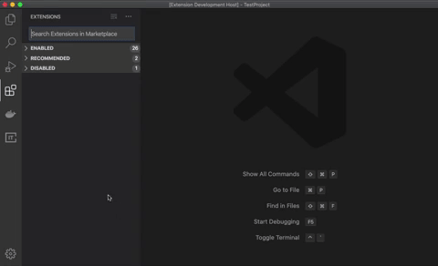
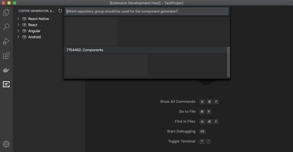
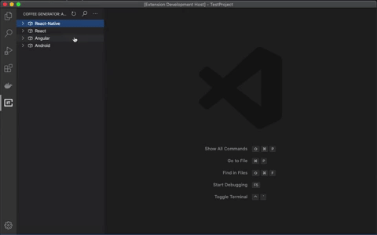
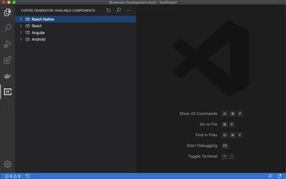
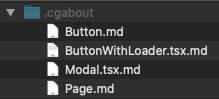

# Coffee IT Component Generator
This tool allows you to easily host your own component library on GitLab and use it in your projects. It enables you to host a collection of standard components (i.e. a maps or login component that you often reuse) on GitLab repositories. These repositories reside in a repository group. With this tool, you can download these standard components and use them in your project.

#### But NPM exists right?
Yes, this is to be used in conjunction with an NPM registry. This tool should be used when you want to incorporate a component in your project, but also want to change that component to the projects needs. You can also use this for other project related files like readme templates, configuration files and much more. All the stuff that you want to reuse but don't want to be placed in the 'node_modules' folder.

## Usage
After installing, open the extension from the sidebar. On first install, you will be asked to give the app access to your GitLab account. 

If not configured, you will see a prompt asking you to choose a repository group. This is the place where your component library resides.

## Functionality

### Download
You can download shown components to your project folder:

### View documentation
If a component features documentation, you can view that as follows:

Documentation consists of a Markdown file, which you need to place in a folder called '.cgabout', in the root of the repository. This file needs to have the exact same name (with file extension if applicable) as the component itself. Example:

## Preferences

Additional settings can be configured from the VS Code preferences menu. You can reset these settings from the three dots in the title bar.